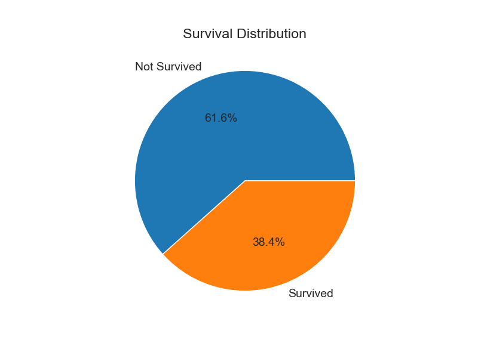
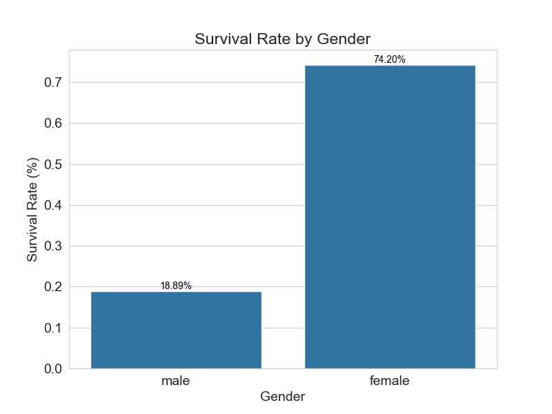
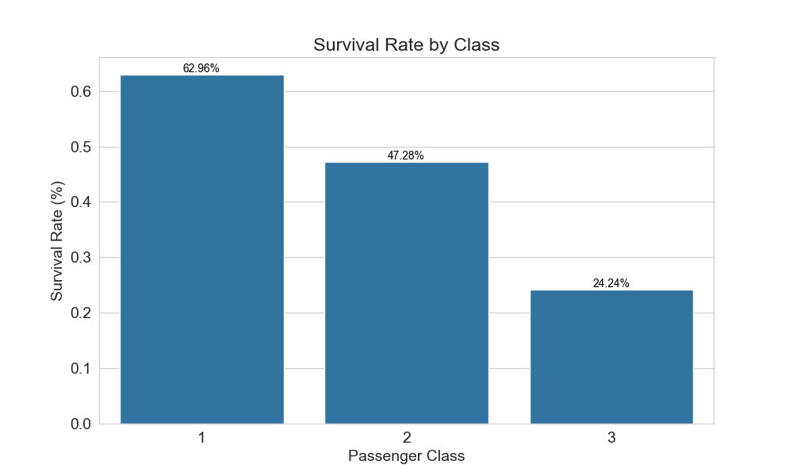
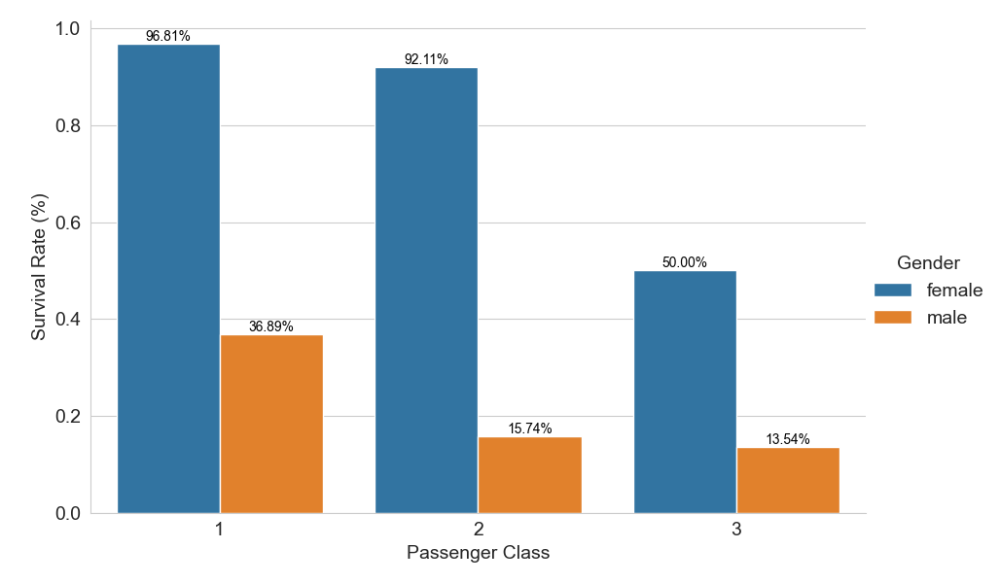

# Titanic Survival Analysis
[](https://www.python.org/) [](https://pandas.pydata.org/) [](https://seaborn.pydata.org/) [](https://jupyter.org/)

## 📊 Project Overview
Comprehensive exploratory data analysis (EDA) of the Titanic dataset, investigating factors that influenced passengers' survival chances. This project demonstrates skills in data manipulation, visualization, and statistical analysis using Python.

## 📈 Key Findings
1. **Survival Distribution**
    - Only 38.4% of passengers survived the disaster
    - 61.6% of passengers did not survive

2. **Social Class Significantly Influenced Survival**
    - **1st class:** 62.96% survival rate
    - **2nd class:** 47.28% survival rate
    - **3rd class:** Only 24.24% survival rate

3. **Gender Was a Determining Factor**
    - **Women:** 74.20% survival rate
    - **Men:** Only 18.89% survival rate

4. **Correlation Analysis**
    - The "adult_male" variable had the highest negative correlation with survival (-0.56)
    - Fare had a moderate positive correlation (0.26)
    - Passenger class had a significant negative correlation (-0.34)

5. **Class and Gender Interaction**
    **Women in 1st class:** 96.81% survival rate
    **Women in 2nd class:** 92.11% survival rate
    **Women in 3rd class:** 50.00% survival rate

    **Men in 1st class:** 36.89% survival rate
    **Men in 2nd class:** 15.74% survival rate
    **Men in 3rd class:** 13.54% survival rate

## 🛠️ Technologies Used
- Python 3.8+
- Pandas - Data manipulation
- Seaborn - Data visualization
- Matplotlib - Chart creation
- Jupyter Notebook - Analysis environment

## 🚀 How to Run
1. **Clone the repository:**
```
bash git clone https://github.com/vinikev/titanic-survivor-analysis.git
cd titanic-analysis
```
2. **Install dependencies:**
```
bash pip install pandas seaborn matplotlib jupyter
```
3. **Run the Jupyter Notebook:**
```
bash jupyter notebook notebooks/titanic_analysis.ipynb
```

## 📋 Conclusions
**Social class:** Higher-class passengers had priority on lifeboats

**Gender:** The "women and children first" policy was widely followed

**Age:** Children had higher survival rates

## 👨‍💻 Author
Vinícius Azevedo Monteiro

[LinkedIn](https://www.linkedin.com/in/vinicius-amonteiro/)

[GitHub](https://github.com/vinikev)

## 📊 Visualizations
**Survival Distribution**


**Survival by Gender**


**Survival by Class**


**Correlation Heatmap**


**Survival by Class and Gender**
